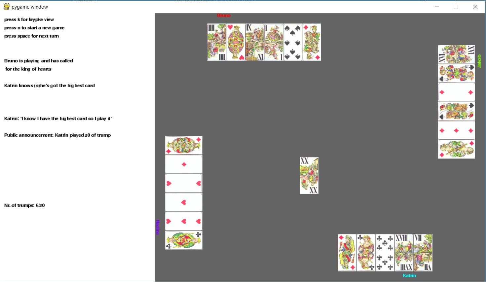

# Introduction

When playing games which are not perfect information games, where there is relevant information which might not be available to all players, maintaining knowledge about what other agents in the game know is important for predicting the actions of one's opponents, and thus choosing appropriate actions accordingly.

# Konigrufen
