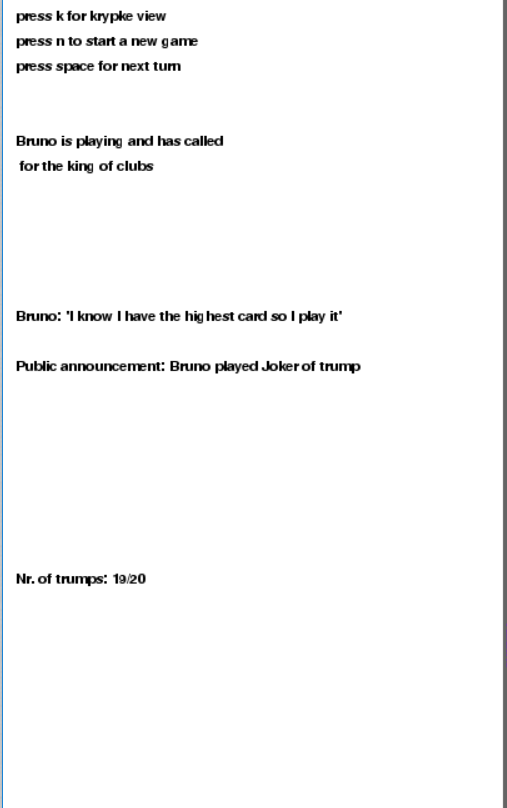
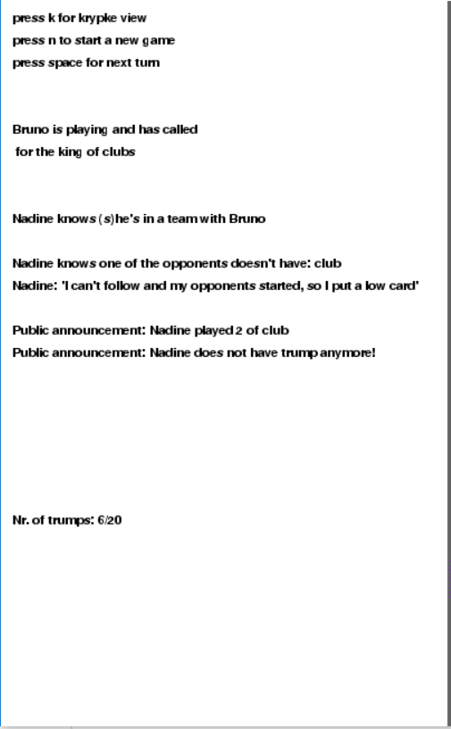
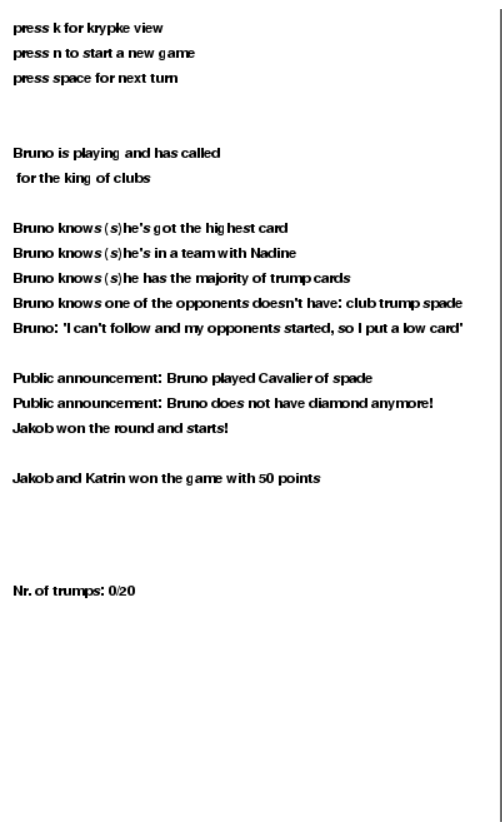
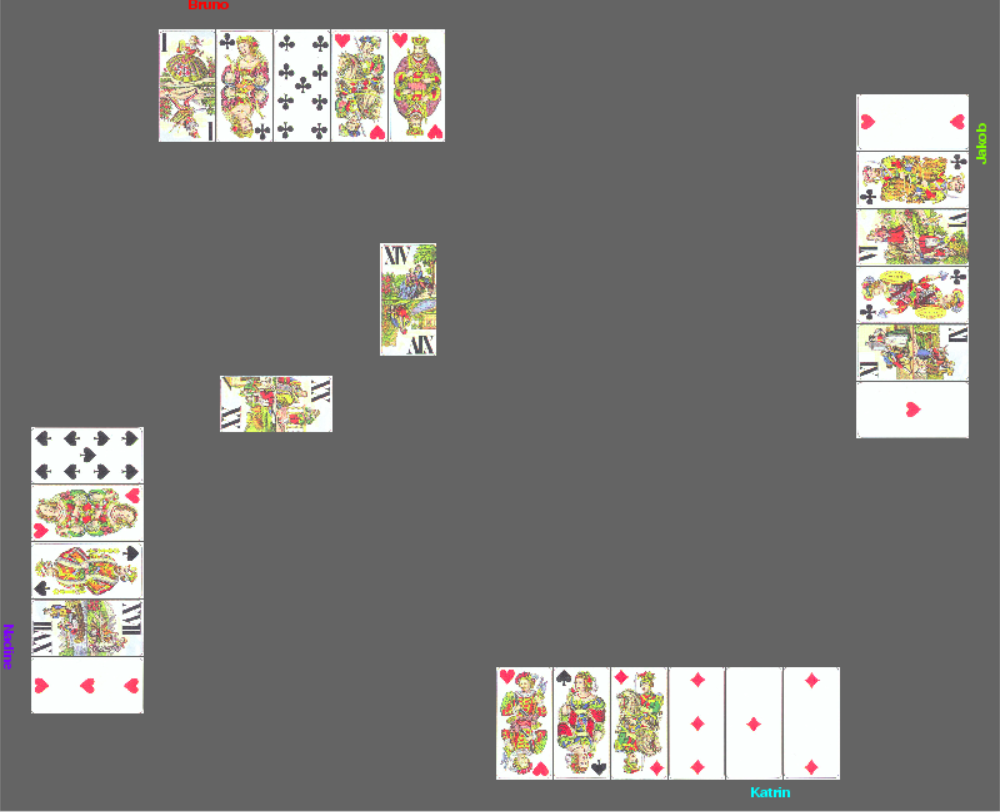
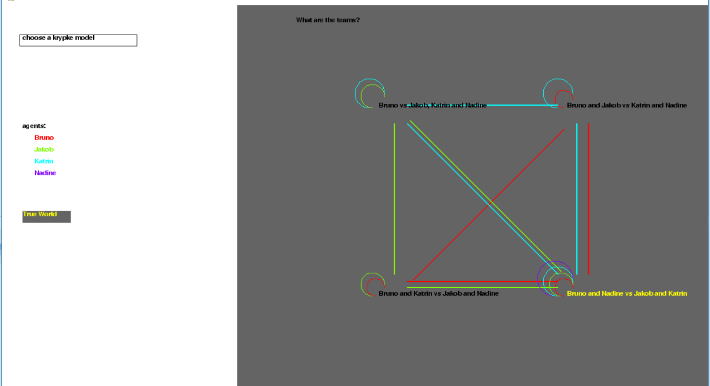
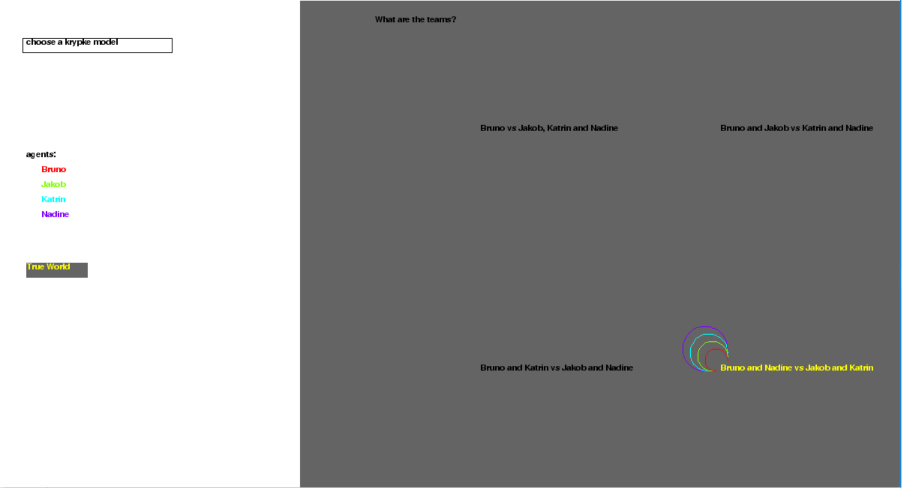
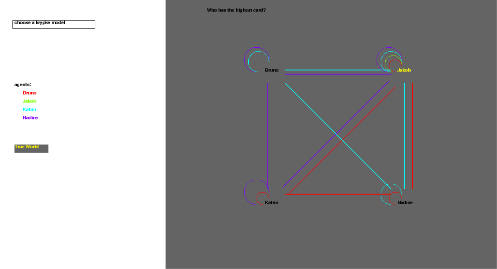

# Introduction

When playing games which are not perfect information games, where there is relevant information which might not be available to all players, maintaining knowledge about what other agents in the game know is important for predicting the actions of one's opponents, and thus choosing appropriate actions accordingly. This knowledge can be modeled in epistemic logic, and visualized with kripke models, and in this project we do both with the game Konigrufen, a game in which not only the complete state of the game hidden, but the objectives of each player is not perfectly known. For a player, or agent, to win the game they need to obtain as many points as possible (or at least more than half of the total points in the game). In order to increase the likelihood of accomplishing this, they need to win as many tricks as possible which yield as many points as possible. Therefore, for every trick they need to try to play the highest card out of all four players (while adhering to the rules). In order to properly do so, all the agents are required to reason about what their best card to play is. In this game proper reasoning can only be done when there is knowledge present about an agent's cards and its opponent's cards. Therefore in this implementation of Konigrufen, as the game progresses, public announcements are made based on actions of agents which updates their knowledge. We display the knowledge and reasoning of each agent during the game when it's their turn to play. Additionally, during the game the user is able to switch to a display where visualization of a couple of Kripke models is possible, which are also updated throughout the game. 
With this project we want to show that including components of epistemic logic in a simulation of a game, allows us to analyze realistic behaviour of agents playing the game.

## How to run?
In order to run our program, download the .zip or .tar.gz file. Additionally you will also need [Python](https://www.google.com/) (either version 2.7 or 3.5) and the [Pygame Module](https://www.pygame.org/). To run the Konigrufen program, unzip the folder after downloading it and execute the main.py file with python. On Mac/Linux run the command: python main.py from the command prompt. On Windows the standard Python installer associates the .py extension with a python file, so you should be able to double click main.py in order to run it, or you can also run it in the command prompt if you want with python main.py after locating its directory.

# Konigrufen

Konigrufen is a trick-taking game from Austria, which unlike many games uses tarock cards: 


Players collect points over many games, but for this project we will only be simulating individual games.

## The Rules

The 54 cards in play are divided into 5 suits, the 4 regular suits (hearts, clubs, diamonds and spades) as well as a fifth suit of trump cards. Each of the 4 regular suits has 8 cards, divided into 4 face cards and 4 number cards, the only quirk relating to these is that with the red suit number cards, the lowest in number is the highest in value/strength and for the two black colored suits, the higher number wins. There are 22 trump cards, 21 numbered trump cards and one fool which in this set of rules counts as the 22nd and highest trump card.

| __Red Suits__ | __Black Suits__ |
|---------------|-----------------|
| King          | King            |
| Queen         | Queen           |
| Cavalier      | Cavalier        |
| Jack          | Jack            |
| 1             | 10              |
| 2             | 9               |
| 3             | 8               |
| 4             | 7               |

The game starts with first 6 cards being set aside for later, then each player getting dealt 12 cards. The cards are dealt in a counterclockwise order starting with the person sitting immediately to the left of the dealer. Once the cards are dealt, each player is asked to state their intentions for this game, this is done in the opposite (clockwise) order starting with the person sitting to the right of the dealer. Each player may either do nothing or play. There are several things someone who wants to make a play can decide, all relating to the 6 cards set aside at the start of the game. They may play with 3, 2, 1 or none of the cards in the pile set aside or the 'talon'. This means that the talon is either divided into two sets of 3 cards (in order) 3 sets of 2 cards or 6 individual cards by the dealer (or someone else in case the dealer is the one making the play). Before the cards in the talon are opened, the person making the play must call a king of one of the four suits to his side. In the event that this king is in the talon, they now play alone. The play maker is allowed to take one of the sets of cards from the talon, either one of the groupings of 3 if this was the number they chose or one of the other configurations. They take these cards into their deck and place the corresponding number of cards face down in front of them as a start to their collection pile. any points in this pile will count towards the total number of points they manage to accrue in the trick taking stage of the game.

In the main stage of the game players start playing for tricks, the game proceeds clockwise, starting with the same person whom the dealer started dealing to. If a player starts with a certain suit, all other players must follow with that suit. If they do not have any cards in this suit, they may play one of the 22 trump cards, if they also have no trump cards, they may play any other card in their hand.

Once all the cards are played, whoever had the king called at the start of the game, combines their pile of taken tricks with the play maker and the other two players in the game do likewise. Cards are counted in groups of 3, a king is worth 5 points, a queen 4, a knight is worth 3 points a jack is worth 2 and every other card is worth 1 point. If there are 2 face cards in this set of 3, 1 point is deducted from the total and if there are 3 face cards, then 2 points are deducted to make the counting always add up to 70. In addition to the face cards, some trumps have value as well. The number 1 trump, the number 21 trump and the fool are all worth 5 points each and count as face cards when being counted. The difference between the two teams in points is then taken as the score. The only people getting any score from a game are the one who made a play and the one who was holding the king that was called at the start of the round. The other two players were essentially 'defending' or trying to minimize the number of points the other two receive at the end of the round.

## Including Epistemic Logic 
```diff
+ explain how we integrated PAL etc. in the game (klemen?)
```
- Knowledge
- Public announcements
- Kripke models

# Object Oriented Implementation of Konigrufen
In this section we will describe the several classes that we created and how they are integrated in the program. In our version of the game we have one player which always starts the game: 'Bruno'. He gets to call the King (determining the teams). Additionally, each game consists of one hand. A new game can be started with new hands, but these are kept independent of each other to simplify the analysis. We also made some further restrictions which we will elaborate on later.
## Game.py
### Cards
The `Card` class is a tuple consisting of four components `(suit,value,image,score)` where suit and image speak for themselves. The distinction between value and score however is that the former is the value the card has during the game (e.g. to win a trick) and the latter is for what the card is worth in score for winning the game. Additionally, the value of a card represents what the card actually is dependent on whether it's a trump or not (e.g. a value of 8 for a non-trump card is a King, a value of 7 is a Queen etcetera). For trump cards it simply resembles the trumps from 1 up to 21, and value 22 represents the Joker. At the start of the game all cards are randomly shuffled and 12 are assigned to each player.

However, it is worth noting that in order to be sure that all interesting cards are included in each game (e.g. the Joker and Kings), we limited the number of cards from 54 to 48, such that each player has exactly 12 cards.  We excluded the first card of each common suit and excluded trump cards '2' and '3'.

### Game State
One important class to keep track of everything happening in the game is the `game_state` class. It takes three input arguments `(players, model_list, useKnowledge)`. The `model_list` is a list which specifies which Kripke models are to be updated and visualized. `useKnowledge` is a boolean variable which determines whether the agents are to use their knowledge in the game or not. This class contains about 18 variables which are used and updated throughout the game. Some of the most important variables are for example the list of players, what king has been called, who's turn it is, what the leading suit is and what the highest card currently in the game is. 

### Player
The `Player` class contains 10 variables, as well as 3 functions and takes 3 input arguments: `(name, hand, knowledge)`. The variables are for example the name, the hand, the teammates, the opponents, knowledge and reasoning. Some of these variables are updated throughout the game, such as knowledge which is a class by itself (see next subsection) and the reasoning of the agent in each turn. The player class contains functions such as `determineCard()` which determines what is the best card to play in the current game state. In our game we have four players: Bruno, Jakob, Katrin and Nadine.

#### Knowledge
Each agent has knowledge which is represented in a separate class `Knowledge`. This class is a tuple of `(hasHighestCard, knowsTeammate, trumpAdvantage)` and additionally contains two variables which represent the knowledge of the agent's opponents not possessing a certain suit. Most of this knowledge is unknown to most players at the start of the game. 
- `hasHighestCard` is a boolean which states whether the agent has the highest card. As it is common knowledge what the highest card in the game is, each player knows whether they do or don't. 
- `knowsTeammate` is also a boolean which states whether the agent knows its teammate. At the start of the game, only the the player which possesses the called King knows their teammates, all other players have to find out who their teammates and opponents are through public announcement updates. 
- `trumpAdvantage` is again a boolean which states whether the player knows that it has the majority of trump cards in the game. The total number of trumps is common knowledge as each player can keep track of it and there is a fixed amount. If the player has more than half of the trumps, it certainly has an advantage which then is strategically used.
- `opponentLacksSuit` is a boolean variable which states whether the agent knows that its opponents don't have a certain suit which can also be found out through public announcements and can be used strategically. The variable `lackedSuits` is a list which contains all the suits that the opponents lack.

#### determineCard()
As mentioned in the section of the `Player` class, there is a function `determineCard()`. In this function the knowledge described in the previous subsection of the player is used to determine what card to play. The function has two cases:
##### The player starts
When the player starts and usage of knowledge is enabled in the game, it reasons as follows:
- If the agent knows that it has the highest card (i.e. `knowledge.hasHighestCard` is true), then it will always play that card as first to be certain it wins that trick and can start again.
- If the agent knows that it has the majority of trump cards (i.e. `knowledge.trumpAdvantage` is true) then it will play an arbitrary trump card in order to make sure the other players lose more trump cards and being more likely to win the trick.
- If the agent knows that one of its opponents does not possess a certain suit (i.e. `knowledge.opponentLacksSuit is true`), and the agent itself does have that suit, then the agent will play that suit. However, this knowledge cannot be used if the agent does not know who its opponents/teammates are. Therefore it is first required to have that knowledge (i.e. `knowledge.knowsTeammate` is true) in order to strategically use this knowledge. At the start of the game just one player has this knowledge which may be a big advantage.

##### The player doesn't start
When the player doesn't start, there is not much strategic play it can do as it has to adhere to the rules. However, it can try to give its teammates and its opponents as many and as few points respectively as possible. Here the reasoning is presented in order:
- If I possess the suit that is played, I will play that suit.
- If I don't possess the suit that is played and it is not a trump, I play a trump card if I have it.
- If I know who my teammate is and my teammate started this trick , then I play a high valued card.
- If I know who my opponent is and my opponent started the trick, then I play a low valued card.
- If I don't know who my teammate is then I just play a random card.

We went with this type of reasoning for the non-starting players as we are assuming that the player who starts uses the most reasoning and therefore is most likely to win that trick, therefore for a non-starting player it makes sense to base its play on the starting player, rather than basing it solely on its own cards.

### executePlay()
This function is the main function in this file, which calls all the mentioned functions for an agent to play a card. It also checks whether it is the last played card and then determines the winner, or if it's the last card of the game, determines the winning team.

### Update functions
What's left are the functions that update the knowledge of the agents each trick based on the public announcements that are made in the game (e.g. when a player puts on a card and the corresponding information). These are simply functions such as `updateTeammateKnowledge()` which checks whether the King called is played which determines whether the agents know their teammates or not. As such there is also functions like `updateMaxCardKnowledge()` and `updateTrumpKnowledge()` which in turn call functions like `updateKripkeTeams` which update the information included in the Kripke models described in a later section.

## Main.py
This file starts the game and initializes all players, cards and models. It updates the game state in which player's turn it is, whether the trick or game is ended, and processes the keyboard inputs of the user. Pressing spacebar for example makes the game to go to the next step, pressing 'n' starts a new game and pressing 'k' opens the Kripke views.

## Kripke.py 
In this file the Kripke models are initialized and defined.
### Kripke_Model 
This is a class which defines a Kripke model. A Kripke model is a tuple of `(name, agents, worlds, relations)` which are the name of the model, the agents (players), the worlds that should be modelled and the relations between the worlds of the agents. Such a world is for example the class `playerWorld` and `teamWorld`.
#### playerWorld
This class represents the world of a single agent and has `(name, true_world, position)`. Where `true_world` is a boolean determining whether it is the true world.
#### teamWorld
This class represents the world of a team and has `(team1, team2, true_world, position)`. Where `team1` and `team2` state the teams in this possible world.

## Visualization (view.py)
In this class everything we implemented is visualized for the user. Using Pygame allows us to visualize all the components of the games which we consider as three components: on the left the message box which displays all information of the game such as player's reasoning, knowledge and common game information. On the right we have the actual game's GUI, in which the cards of the agents are visible and which cards are being played. Finally we have implemented a Kripke view in which Kripke models can be selected (this view can be accessed by pressing 'k'. 
### Message box
In the message box first some instructions are displayed for the user: pressing spacebar makes the game go to the next turn, pressing 'n' makes a new game, pressing 'k' enables the Kripke-view. Additionally, for the agent currently playing its knowledge is displayed, after which it's reasoning is displayed for playing the card it played. Finally public announcements and common knowledge are displayed. Below some examples are presented of the message box at the start of the game, an intermediate stage of the game and the end of the game respectively.

 

### Game GUI
Below an example can be found of how the game itself looks like. We have four players, one at each side of the board and in the middle we have the card disposal area. 


### Kripke Model View
When pressing 'k' the user can access the Kripke View. In this view there is a dropdown menu where the user can select a Kripke model they would like to see. In the image below is shown how such a Kripke model looks like for modelling the knowledge of each player about what the teams are. As Bruno always starts the game these are the possible worlds that are left in the game. Bruno also calls the King, therefore the player in possession of this King knows the true world of team (colored yellow). In this example Nadine has the called king and therefore is the only one that knows she and Bruno form a team. 



As the game proceeds, more information is presented to the agents and as such they figure out what the teams are. When an agent acquires such knowledge the Kripke model gets updated accordingly which is shown in the image below. In this example, apparently Katrin could not follow the suit that was played first in the trick. However, as this suit is the same as the suit of the called King, the agents now know that Katrin is definitely not in a team with Bruno and the Kripke model is updated accordingly. 


Eventually the agents figure out what the teams are, which is often when the King itself is played by one of the agents. The Kripke model then turns into the following example.



Another example, shown below, is each agents knowledge about who possesses the highest card in similar fashion as the team-knowledge model. 

